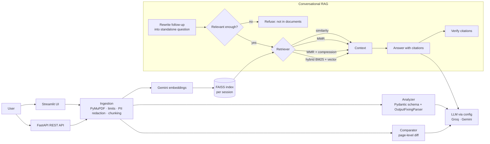

# 📄 Document Portal

**LLM-powered document intelligence: analyze, chat with, and compare documents.**

Upload a PDF and get a structured briefing in seconds, ask questions across several documents with cited answers, or find page-level differences between two versions of a file. Built with LangChain, FAISS, FastAPI and Streamlit, with provider-agnostic LLMs (Groq or Google Gemini) switched by config.

Hardened for regulated, safety-critical settings such as airline manuals: hybrid keyword + semantic search for part numbers and codes, a guardrail that refuses instead of guessing, verified citations with document revisions, PII redaction, role-based access and provider fallback. See [docs/PRODUCTION.md](docs/PRODUCTION.md).


---

## Features

| Module | What it does |
|---|---|
| **Document Analyzer** | Extracts title, author, dates, page count, language, sentiment and a bullet summary as schema-validated JSON. Malformed LLM output is repaired automatically by a self-correcting parser. |
| **Single-document chat** | History-aware RAG: follow-up questions are rewritten into standalone ones, answered only from retrieved context, with `[file, p.N]` citations. Sessions persist to disk. |
| **Multi-document chat** | One FAISS index across many files with four retrieval strategies: similarity, **MMR** (diverse results across files), **MMR + contextual compression** (drops redundant and off-topic chunks) and **hybrid** (BM25 keywords + vectors fused with Reciprocal Rank Fusion; best for part numbers, codes and IDs). |
| **Guardrails** | Refuses without calling the LLM when nothing relevant is found; checks every `[file, p.N]` citation against the retrieved chunks and returns `grounded: true/false`; answers carry the document revision. |
| **Document compare** | Page-by-page diff of a reference vs. an actual PDF (e.g. manual Rev 12 vs Rev 13), returned as validated `{Page, Changes}` rows. |
| **Security & privacy** | API-key auth with roles, per-collection access control, PII redaction before embedding/LLM/logs, upload limits, request IDs and latency logging, LLM retries + cross-provider fallback. |
| **Evaluation** | Hit rate@k and MRR for retrieval, keyword coverage and LLM-as-judge faithfulness for answers, a strategy benchmark on a labelled question set, and a CI gate that fails if retrieval quality drops. |

## Architecture



## Tech stack

- **LLM orchestration:** LangChain 1.x (LCEL), prompt library, Pydantic output schemas
- **Models:** Groq `llama-3.3-70b-versatile` or Google `gemini-2.5-flash`, `gemini-embedding-001` embeddings (all set in `config/config.yaml`)
- **Retrieval:** FAISS, BM25 hybrid search with Reciprocal Rank Fusion, MMR, contextual compression
- **Serving:** FastAPI (OpenAPI docs at `/docs`), Streamlit
- **Engineering:** structured JSON logging with request IDs, custom exceptions with file/line tracing, API-key auth with roles, dependency injection for testability, pytest, ruff, GitHub Actions (tests + retrieval-quality gate + Docker build)

## Quick start

```bash
git clone https://github.com/Saravanakumar-SKASC/Document-Portal.git
cd Document-Portal
python -m venv .venv && source .venv/bin/activate   # Windows: .venv\Scripts\activate
pip install -r requirements.txt

cp .env.example .env        # then add GOOGLE_API_KEY (and GROQ_API_KEY if LLM_PROVIDER=groq)
```

Try it with the **fictional** airline documents in `samples/` (Demo Air baggage policy Rev 12/13, a brake inspection task card and a cabin crew SOP). They are invented for demos and must not be used operationally.

**Web UI**

```bash
streamlit run streamlit_ui.py
```

**REST API**

```bash
uvicorn app:app --reload    # interactive docs at http://127.0.0.1:8000/docs
```

**Docker**

```bash
docker build -t document-portal .
docker run -p 8000:8000 --env-file .env document-portal
```

## API

All endpoints except `/health` need an `X-API-Key` header when `API_KEYS` is set (see `.env.example`). Without it the API runs in development mode.

| Method | Endpoint | Body | Returns |
|---|---|---|---|
| `GET` | `/health` | – | `{"status": "ok"}` |
| `POST` | `/analyze` | `file` (PDF) | structured metadata |
| `POST` | `/chat/index` | `files` (PDF/TXT/MD), optional `allowed_roles`, `revision` | `session_id`, chunk count, roles |
| `POST` | `/chat/query` | `{session_id, question, strategy, chat_history}` | answer, sources, citations, `grounded`, `refused` |
| `POST` | `/compare` | `reference`, `actual` (PDFs) | list of `{Page, Changes}` |

```bash
curl -H "X-API-Key: $KEY" -F "files=@samples/demoair_task_card_ata32_brakes.pdf" \
     -F "allowed_roles=engineering" -F "revision=Rev 7" localhost:8000/chat/index
curl -X POST localhost:8000/chat/query -H "X-API-Key: $KEY" -H "Content-Type: application/json" \
  -d '{"session_id": "multi_...", "question": "When must brake P/N 2315-0045-001 be replaced?", "strategy": "hybrid"}'
```

## Evaluating retrieval

```bash
python scripts/evaluate.py --offline            # no API keys; uses samples/ + samples/eval_set.jsonl
python scripts/evaluate.py --docs a.pdf b.pdf --eval-set questions.jsonl   # real embeddings
```

It prints hit rate@k and MRR per strategy plus each question's best-chunk similarity, which is how you calibrate `guardrails.min_relevance`. Or from Python:

```python
from src.multidoc_chat.data_ingestion import MultiDocIngestor
from src.multidoc_chat.evaluation import EvalExample, compare_strategies

store = MultiDocIngestor().ingest(["policy.pdf", "handbook.pdf"])
examples = [
    EvalExample("How much annual leave?", expected_source="policy.pdf", expected_page=2),
    EvalExample("What is the remote work policy?", expected_keywords=["remote", "days"]),
]
print(compare_strategies(store, examples))
# {'similarity': {'hit_rate': ..., 'mrr': ...}, 'mmr': {...}, 'mmr+compression': {...}, 'hybrid': {...}}
```

## Tests

59 tests run fully offline (no API keys): a scripted fake LLM plus a small bag-of-words embedding model, so retrieval tests check genuinely relevant results. They cover the pipelines, the API, auth and role checks, PII redaction, limits, guardrails, citation checks and provider fallback.

```bash
pip install -r requirements-dev.txt
pytest -q && ruff check .
```

## Project structure

```
├── app.py                     # FastAPI app
├── streamlit_ui.py            # Streamlit UI
├── config/config.yaml         # models, chunking, retrieval settings
├── src/
│   ├── document_analyzer/     # PDF ingestion + metadata extraction
│   ├── singledoc_chat/        # ingestion, conversational RAG, evaluation
│   ├── multidoc_chat/         # ingestion, hybrid, MMR, contextual compression, strategy benchmark
│   └── doc_compare/           # page-level comparison
├── utils/                     # config, model loader + fallback, document ops, RAG core, PII, security
├── scripts/                   # evaluate.py, make_demo_docs.py
├── samples/                   # fictional Demo Air documents + labelled eval set
├── docs/PRODUCTION.md         # production readiness and airline deployment notes
├── prompt/prompt_library.py   # all prompts in one place
├── model/models.py            # Pydantic schemas
├── logger/ · exception/       # structured logging, custom exceptions
└── tests/                     # offline pytest suite
```

## Roadmap

- OCR and table-aware parsing for scanned manuals
- Cross-encoder reranker on top of hybrid search
- Bilingual (English / Chinese) embeddings and evaluation
- Managed search (OpenSearch or pgvector), SSO and async ingestion on AWS

Details in [docs/PRODUCTION.md](docs/PRODUCTION.md).

## Author

**Saravanakumar N** · MSc Artificial Intelligence, National College of Ireland
[LinkedIn](https://linkedin.com/in/saravanakumarn3899) · [GitHub](https://github.com/Saravanakumar-SKASC) · [Portfolio](https://datascienceportfol.io/saravanakumar3899)
