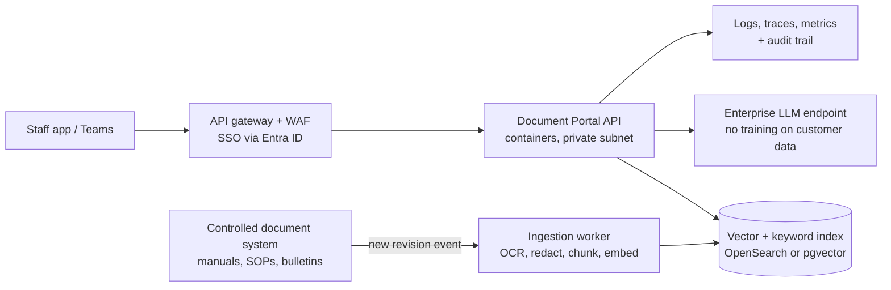

# Production readiness: taking Document Portal to an airline

This note explains what "production-ready" means for a document assistant used inside an
airline (engineering, flight operations, cabin crew, customer service), what this repo already
does, and what a real deployment would add.

> The sample documents in `samples/` belong to **Demo Air, a fictional airline**. They are
> invented for demos and tests and must never be used for real operations.

## 1. Why airlines are a demanding customer

| Airline reality | What it means for the system |
|---|---|
| Manuals are **safety-critical** (maintenance task cards, SOPs, MEL) | Never guess. Answer only from approved documents, cite the page, refuse when unsure. |
| Documents are **revised constantly** (Rev 12 → Rev 13) | Every answer must say which revision it came from; revision diffs must be easy to review. |
| Text is full of **exact identifiers**: part numbers `2315-0045-001`, ATA chapters `32-41-00`, flight numbers | Pure semantic search blurs these. Add keyword search (hybrid retrieval). |
| **Different staff see different documents** | Role-based access: an engineer's manuals are not a cabin crew tool, and vice versa. |
| Passenger and staff **personal data** appears in reports | Mask PII before it is embedded, stored, logged or sent to an LLM (Hong Kong PDPO, EU GDPR). |
| 24/7 operations across time zones | Retries, timeouts, a fallback LLM provider, request tracing, health checks. |
| Regulators expect **human oversight** (EASA calls assistive AI "Level 1") | The tool assists; the certified engineer or crew member decides. Show sources so they can check. |

## 2. What this repo implements

| Control | Where | How it works |
|---|---|---|
| Hybrid retrieval | `src/multidoc_chat/hybrid.py` | BM25 keyword search + vector search, merged with Reciprocal Rank Fusion. Tokenizer keeps `2315-0045-001` and `32-41-00` whole (and indexes their parts). |
| Relevance guardrail | `utils/rag_core.py` → `relevance_gate_for` | If the best chunk's cosine similarity is below `guardrails.min_relevance`, the API returns a fixed "not found" answer **without calling the LLM** (no hallucination, no cost). |
| Citation verification | `utils/rag_core.py` → `check_citations` | Parses `[file, p.N]` tags from the answer; `grounded: true` only if at least one citation exists and every citation points to a chunk that was actually retrieved. |
| Revision tracking | `/chat/index` `revision` field | Stored on every chunk, shown in the prompt context and returned with each source. |
| Revision diff | `/compare` | Page-by-page changes between two versions, e.g. baggage policy Rev 12 vs Rev 13. |
| PII redaction | `utils/pii.py` | Emails, international/labelled phone numbers, Luhn-valid cards, HKID, labelled passport numbers are masked at ingestion and in logs. Aviation identifiers are deliberately left alone (tested). |
| Authentication | `utils/security.py` | `X-API-Key` header; keys map to roles via `API_KEYS`. Constant-time comparison. |
| Role-based access | `/chat/index` `allowed_roles`, `/chat/query` | Each collection records its allowed roles. Other callers get **404** (the collection is hidden, not just forbidden). You can't share a collection with roles you don't hold. |
| Input limits | `config.yaml` → `limits` | Max file size, pages, files per request, question length, history length. Encrypted PDFs rejected. |
| LLM resilience | `utils/model_loader.py` | Per-call retries and timeouts; automatic fallback to the second provider (Groq ⇄ Gemini) when its key is configured. |
| Observability | `app.py` middleware, `logger/` | Every request gets an `X-Request-ID` (propagated if the caller sends one); JSON logs carry request id, caller, roles, status and latency. |
| Evaluation gate | `scripts/evaluate.py`, CI | Hit rate@k and MRR per strategy on a labelled question set; CI fails if retrieval quality drops below the threshold. Also prints similarity scores used to calibrate the guardrail. |

## 3. Reference deployment for an airline



- **Ingestion is event-driven**: when the document control system publishes a new revision,
  a worker re-indexes it and retires the old revision, so answers never come from superseded manuals.
- **Managed search** (OpenSearch supports BM25 and vectors in one engine) replaces local FAISS files,
  so indexes survive restarts and scale across containers.
- **Enterprise model endpoints** (e.g. Amazon Bedrock, Azure OpenAI) keep prompts inside the
  company's cloud agreement. Choose a region that meets data-residency requirements.
- **SSO** replaces API keys: roles come from the identity provider's groups.
- **Secrets** live in a secrets manager, never in `.env` files on servers.

## 4. What I would add next (honest gaps)

| Gap | Why it matters | Approach |
|---|---|---|
| OCR | Older manuals and signed forms are scanned images | Tesseract via PyMuPDF, or a managed OCR service |
| Table-aware parsing | Limits and torque values often live in tables | Layout-aware parser; keep tables as whole chunks |
| Reranker | Better top-3 precision | Cross-encoder reranking of the top 20 hybrid results |
| Chinese / Cantonese | Hong Kong operations are bilingual | Multilingual embeddings; test with a bilingual golden set |
| Answer evaluation at scale | Faithfulness drifts when prompts or models change | Nightly LLM-as-judge on a larger golden set, tracked over time |
| Async ingestion | Large manuals take minutes to embed | Queue + worker; the upload returns a job id |
| Rate limiting and quotas | Protect cost and availability | At the API gateway |
| Audit log retention | Regulators may ask who saw what | Append-only store with retention policy |
| NER-based PII | Regex misses names and addresses | Microsoft Presidio or a managed PII detector |

## 5. Calibrating the guardrail

`guardrails.min_relevance` depends on the embedding model. Run

```bash
python scripts/evaluate.py --docs your_manuals/*.pdf --eval-set your_questions.jsonl
```

Look at the similarity scores of questions that **should** be answered and a few that
**should not**, and set the threshold between the two groups. Re-check it whenever you
change embedding model or chunking.
